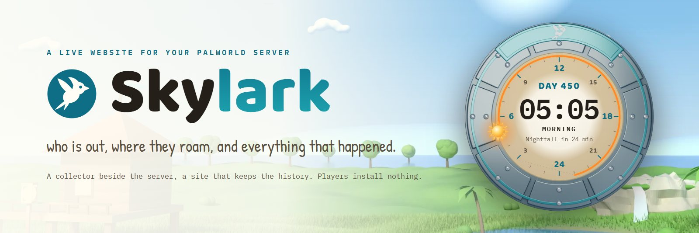
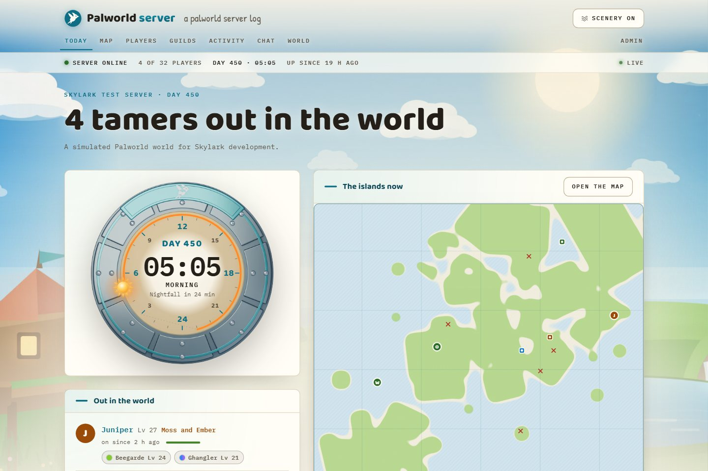
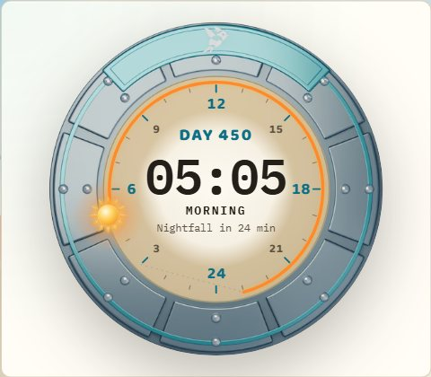
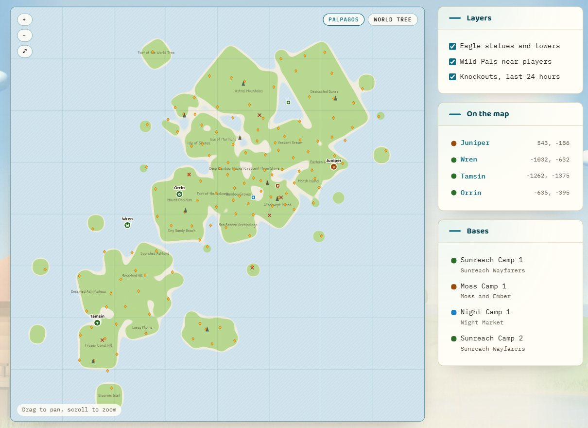
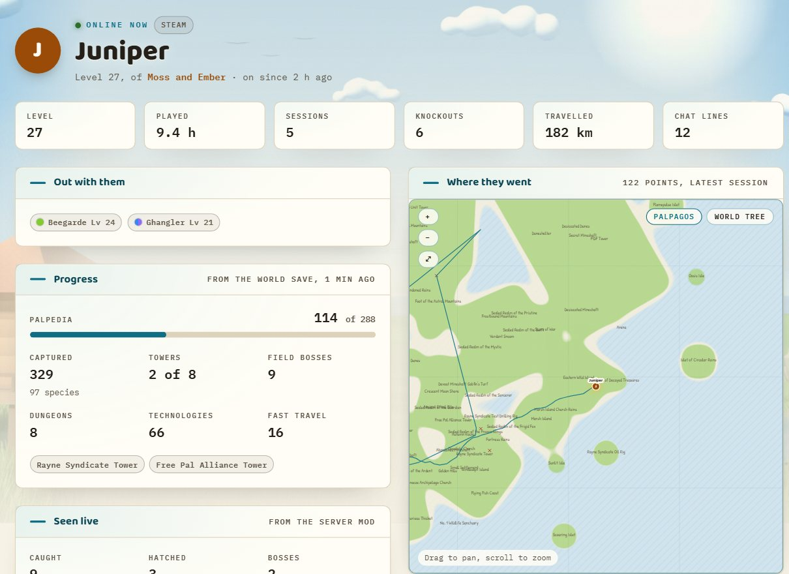
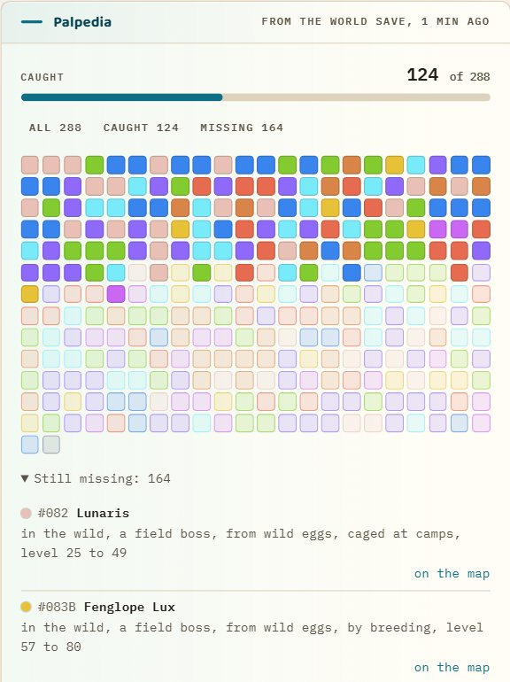
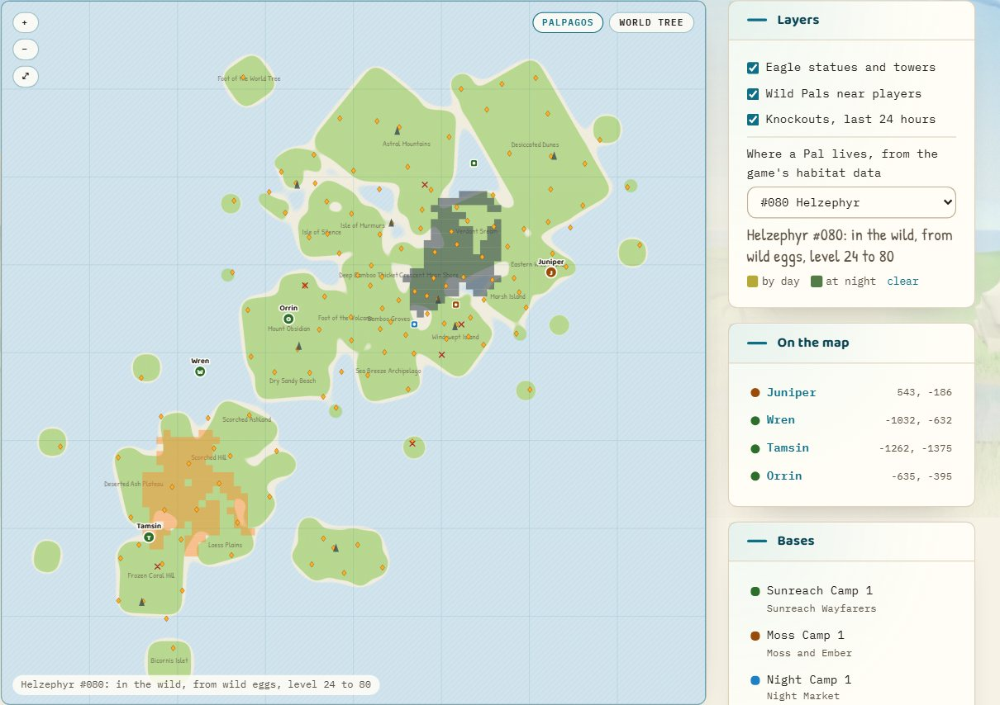
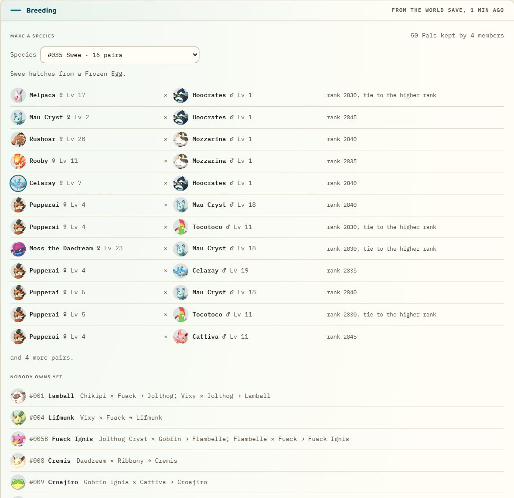
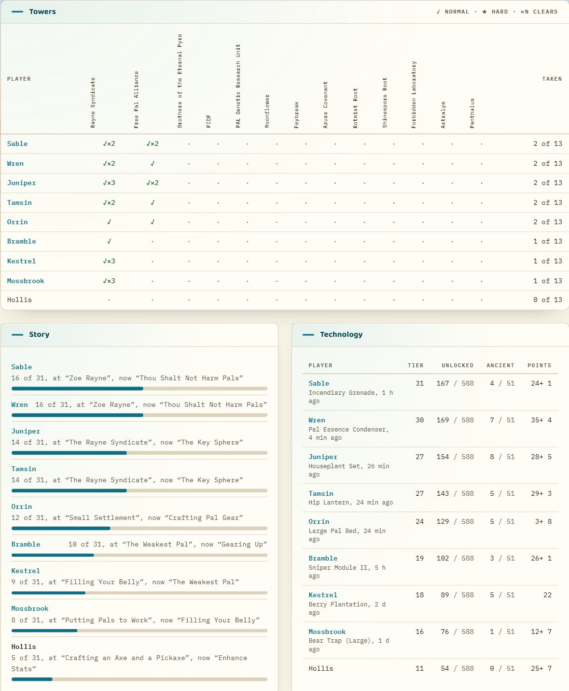

<p align="center">
  
</p>

<p align="center">
  <a href="https://oddessentials.github.io/skylark/"><b>Website</b></a> &nbsp;·&nbsp;
  <a href="#install"><b>Install</b></a> &nbsp;·&nbsp;
  <a href="#collector-reference"><b>Collector</b></a> &nbsp;·&nbsp;
  <a href="web/openapi.yaml"><b>API</b></a> &nbsp;·&nbsp;
  <a href="LICENSE"><b>MIT licence</b></a>
</p>

Skylark gives your Palworld dedicated server its own website. A small collector runs beside the server and reports who is online, where they roam and what happens in the world, and the site shows it live and keeps the history. Players install nothing, and the server needs no mods.

<p align="center">
  
</p>

## Only in Skylark

<table>
  <tr>
    <td width="34%" valign="top">
      
      <h3>Sun dial</h3>
      The in-game day and hour on a capture-sphere dial, live from the server's own clock. It counts down to nightfall and dawn at the hours the game really uses, and runs at the server's day and night speeds.
    </td>
    <td width="66%" valign="top">
      
      <h3>The islands, live</h3>
      An original map drawn from the game's own region data, with the Great Eagle Statues and towers. Players move on it as they play, next to the bases, the wild Pals around them and the day's knockouts.
    </td>
  </tr>
</table>



### Player pages

Playtime, sessions, level history, knockouts and distance travelled for everyone who plays, with the Pals out with them right now, the trail of each session on the map, and from the world save their Palpedia, captures and boss records.

<table>
  <tr>
    <td width="34%" valign="top">
      
      <h3>The Palpedia, on your server</h3>
      Every entry each player has caught, from the world save, and what is still missing, with how each species is obtained from the game's own tables: in the wild by day or night, from eggs, by fishing, from cages, raids or breeding. Guild pages show the same across the members, and who has what.
    </td>
    <td width="66%" valign="top">
      
      <h3>Where the missing ones live</h3>
      Pick a Pal on the map and see where it lives, by day and at night, with its wild levels, drawn from the game's own habitat data onto Skylark's map. A missing entry on a player's page takes you straight there.
    </td>
  </tr>
</table>



### Breeding, from the Pals you keep

Every guild page lists the Pals in its members' boxes and parties from the world save, with gender, level, talents, passives and the lucky ones, and works out what they can breed: pick a species and see which of your own pairs make it, unique pairings first and the closest pairs by shared passives on top; see the species nobody owns yet with the shortest chain of breedings from what you have; and the eggs waiting in chests and incubators with the Pal each one holds. The rule is the game's own, read from the server's code, down to how a tie between two ranks is settled, and the Pal pictures are the game's own icons.



### The progression board

One page for the whole server's progress, from the world save: who has beaten which tower, on normal or hard and how many times, with the date the server mod first saw it fall; how far each player is through the story, by the quest chain the game's own quest manager tracks; their technology tier, how much of the tree they have unlocked, the ancient technologies among them and the points they have left to spend; the field bosses and wanted fugitives on Skylark's map, coloured by who beat them; each guild's lab, what it is researching and how far along; and every player's level against their playtime, beside the experience the game asks for at each tenth level. The quest titles, the technology tree, the lab table and the level curve come from the game's own tables and Blueprints; the hard-mode and World Tree save keys were read from the server's code and are marked as not yet seen live.

## Also on the site

- Who is online, with their level, health, guild and Pals, and everything that happened today
- Guilds with their members, roles and bases and the Pals working there, their Palpedia, their kept Pals with a breeding calculator, chat, and a live activity feed
- The progression board: towers, story, technology, field bosses and guild research from the world save
- The world's settings, the server's history and this week's leaders
- An admin area for the collector, server actions (announce, save, shut down with a countdown, kick, ban), backups and a history rebuild
- Switches to hide positions, bases, Pals, chat or guild chat
- A stream overlay with the sun dial and who is on
- With the optional [server mod](mod/README.md) on a Windows server: catches, hatches, boss clears and technology unlocks in the feed, who or what knocked each player out, and each player's tally of them

## Install

1. Run the site with Docker Compose on a machine the collector can reach:

   ```sh
   git clone https://github.com/oddessentials/skylark.git && cd skylark
   cp .env.example .env
   docker compose --profile site up -d --build
   ```

2. Open `/admin` on port 3000, set the password, and copy the collector secret from the Collector page.
3. Download the collector for your platform from a [release](https://github.com/oddessentials/skylark/releases) or pull `ghcr.io/oddessentials/skylark-collector`, or build it with `npm run collector:build` (Go 1.27). Run it beside the Palworld server with that secret and the server's admin password. On Windows it starts the server itself; on Linux it follows the server's Docker container or console output.

The server needs its REST API on (`RESTAPIEnabled=True` and an `AdminPassword`), the launch argument `-enable-gamedata-api` for Pals, bases and knockouts, and `LogFormatType=Json` for joins and chat as they happen. The collector sends only to your site, and the site never shows IP addresses or platform ids publicly.

**Rented servers.** Most hosts let you run nothing beside the server. If yours exposes the server's REST API, run the collector next to the site instead: set `COLLECTOR_SECRET`, `PALWORLD_REST_URL` and `PALWORLD_ADMIN_PASSWORD` in `.env` and start both with `docker compose --profile site --profile remote up -d --build`. Over the network the collector sees who is online, joins and leaves within about 5 s, levels, positions and trails, the server's settings and metrics, and it carries out admin actions. Pals, bases, knockouts and the in-game clock also need the host to accept the launch argument `-enable-gamedata-api`, and chat needs the server's log, which a remote collector cannot read. The REST API is plain HTTP, so prefer a host that serves it over https or through a VPN; the collector warns when the admin password would cross the internet unencrypted. If the host has no REST API but gives FTP or SFTP access to the server's files, set `PALWORLD_REST_URL=off` and point `PALWORLD_SAVES_REMOTE` at the save folder, such as `sftp://user@host:2022/Pal/Saved` or `ftps://user@host/Pal/Saved`, with its password in `PALWORLD_SAVES_PASSWORD`. The collector then reads the world save every 5 minutes: each player's level, Palpedia, captures, boss, story and technology records, guilds with their roles and lab research, and bases with their workers, but nothing live. With both, REST gives the live view and the save the progress.

**Hosts.** What the hosts' own guides said on 2026-09-28. G-Portal's wiki switches the REST API on with `RESTAPIEnabled=True`, `RESTAPIPort` set to the port G-Portal provides and an `AdminPassword`, in the web interface or over FTP in `Pal/Saved/Config/LinuxServer/PalWorldSettings.ini`; the FTP login is under Status > Access Data, so the save is at `ftp://user@host/Pal/Saved`. BisectHosting has Enable RestAPI under Settings > Startup in its Starbase panel and shows the world under `/home/Pal/Saved/SaveGames/0` in the Files tab, which also holds the SFTP credentials: `sftp://user@host:port/home/Pal/Saved`. Host Havoc's configuration editor carries `RESTAPIEnabled`, `RESTAPIPort` and `LogFormatType`; its files come over FTP, or SFTP where the panel shows SFTP Info, with the panel login and the host and port it shows. Nitrado, ZAP-Hosting, GTXGaming and Shockbyte document file access but not the REST API: Nitrado runs Windows servers reached over FTP with the world in `palworld/Pal/Saved/SaveGames/0` (`ftp://user@host/palworld/Pal/Saved`), ZAP-Hosting gives an FTP login under Tools > FTP-Browser with the world in `Pal/Saved/SaveGames/0`, GTXGaming connects over SFTP (FTP on some panels) with the panel password, and Shockbyte over SFTP from Files > SFTP Connect. No host says whether the REST port is open to the internet or lets you add `-enable-gamedata-api`, so count on the save unless yours confirms it; `skylark-collector check` shows what a login reaches.

<details>
<summary><b>Site settings</b></summary>

The site is a SvelteKit app on Node 24 with PostgreSQL 18. It migrates the database when it starts.

| Variable | Default | Meaning |
| --- | --- | --- |
| `DATABASE_URL` | | PostgreSQL connection string. |
| `COLLECTOR_SECRET` | generated | The secret the collector signs its batches with. When unset the site generates one and shows it on the admin Collector page. |
| `ADMIN_PASSWORD` | | The admin password. When unset the first visitor to `/admin` sets it. |
| `ADMIN_SESSION_SECRET` | generated | Signs admin sessions. |
| `PUBLIC_SITE_NAME` | `Palworld server` | The site name; also settable on the admin Settings page. |
| `ORIGIN` | | The address people use, for example `https://skylark.example.com`. Admin changes must come from it. |
| `BACKUP_DIR`, `BACKUPS_KEPT` | `/backups`, `14` | Nightly `pg_dump` backups. |
| `API_MOCK` | `0` | `1` serves the recorded fixtures instead of a database, for trying the pages. |

`/watch` is a stream overlay for OBS or any browser source: the sun dial and who is on, over a transparent background. `?show=clock` or `?show=players` shows one of them, `?size=` sets the dial from 120 to 480 px (the countdown shows above 250), `?limit=` caps the list, `?layout=row` puts them side by side and `?solid` makes the list opaque.

The API is described in `web/openapi.yaml` and served at `/api/v1/openapi.json`. `/api/v1/stream` sends live updates as server-sent events.

</details>

<details id="collector-reference">
<summary><b>Collector reference</b></summary>

The collector is one binary for Windows x64, Linux x64 and Linux arm64. It reads the server's REST API, world snapshot and console log, turns what it sees into events and posts them in signed batches to your site.

What it needs from the server:

- The REST API: `RESTAPIEnabled=True` and an `AdminPassword` in `PalWorldSettings.ini`, or the launch arguments `-restapi -restapiport=8212 -adminpassword=...`. Keep that port on the local network: only the collector talks to it.
- For Pals, bases, knockouts and the in-game clock: the launch argument `-enable-gamedata-api`. Without it the collector still reports the players from `/players`.
- For joins, leaves and chat as they happen: `LogFormatType=Json` (or `-logformat=json`) and a log source. Without one, joins and leaves come from polling `/players`.

| `logs.source` | How the collector reads the server's console |
| --- | --- |
| `launch` | Starts the server itself. On Windows it runs the server under a pseudo console, which hands over every line at once, where a plain pipe holds lines back for a minute or more. Ctrl+C or a service stop asks the server to save and shut down through REST and waits for it. `-logformat=json` and `-enable-gamedata-api` are added when missing. `launch.command` can be `PalServer.exe`, `PalServer-Win64-Shipping-Cmd.exe` or `PalServer.sh`. |
| `docker` | Follows a container's log through the Docker Engine API (`/var/run/docker.sock`, the Windows named pipe or `docker.host`). It remembers where it stopped, so a restart neither repeats nor loses lines. |
| `file` | Follows a file the server's output is written to, through rotation and truncation. On Windows the server writes redirected output in blocks, which holds lines back for a minute or more, so the collector warns about it and `launch` is the better choice there. |
| `stdin` | Reads the server's output from a pipe, for example `./PalServer.sh -logformat=json \| SKYLARK_LOGS_SOURCE=stdin ./skylark-collector-linux-amd64`. The collector stops when the server does. On Windows a pipe holds lines back the same way. |
| `none` | REST only. |

On Windows the collector can run as a service. From a terminal opened with Run as administrator, `skylark-collector service install --config C:\skylark\skylark-collector.toml` registers `SkylarkCollector`, which starts with Windows and restarts after a failure. `service start`, `service stop` and `service remove` manage it, and `--name` lets one machine run several. A service stop or a Windows shutdown saves the world and shuts the server down, with up to three minutes for it. As a service the collector writes `skylark-collector.log` and `palworld-server.log` beside its configuration and reads only that file, not the environment variables of the account that installed it. Closing a console window leaves a program about five seconds, so every stop saves the world first and then asks the server to shut down.

The collector reads `skylark-collector.toml` beside the binary, or the file given with `--config`. Every key can also be set with an environment variable named `SKYLARK_` plus the section and key in capitals, such as `SKYLARK_SITE_SECRET`, `SKYLARK_PALWORLD_ADMIN_PASSWORD` or `SKYLARK_INTERVALS_PLAYERS`; `SKYLARK_LAUNCH_ARGS` takes a JSON array or space-separated arguments.

```toml
[site]
url = "https://skylark.example.com"
secret = "the collector secret from the site"

[palworld]
server_dir = "C:/palworld-server"

[logs]
source = "launch"

[launch]
command = "C:/palworld-server/PalServer.exe"
args = ["-port=8211", "-publiclobby"]
```

| Key | Default | Meaning |
| --- | --- | --- |
| `site.url`, `site.secret` | | The Skylark site and its collector secret. Batches go to `/api/ingest`. |
| `palworld.rest_url` | `http://127.0.0.1:8212` | The server's REST API, or `off` for a collector that only reads the world save. |
| `palworld.admin_password` | | The server's `AdminPassword`. |
| `palworld.server_dir` | | The server's install folder. The collector reads `AdminPassword`, `RESTAPIPort`, `RESTAPIEnabled` and `LogFormatType` from its `PalWorldSettings.ini`, or from the `-UserDir` world in `launch.args`. |
| `logs.source` | `launch` when `launch.command` is set, else `none` | See above. |
| `logs.timezone` | `Local`, `UTC` for `docker` | The time zone of the server's log timestamps. |
| `launch.command`, `launch.args`, `launch.work_dir` | | The server to start. |
| `launch.shutdown_wait`, `launch.shutdown_message` | `5s`, `The server is shutting down.` | The warning players get when the collector stops the server. |
| `launch.enable_gamedata` | `true` | Add `-enable-gamedata-api` when it is missing. |
| `docker.container`, `docker.host` | | The container to follow and the Docker endpoint. |
| `file.path` | | The file to follow. |
| `intervals.players`, `snapshot`, `snapshot_idle`, `metrics`, `heartbeat`, `flush`, `actions` | `5s`, `10s`, `60s`, `30s`, `60s`, `2s`, `5s` | Polling and sending periods. With nobody online a world snapshot goes out every `snapshot_idle`, and with nothing else to send the collector asks the site for admin actions every `actions`. |
| `send_ips` | `false` | Send players' IP addresses with `player.connected`. |
| `journal_dir` | `skylark-journal` beside the config file | Where events wait until the site confirms them. |
| `saves.reader` | `skylark-savereader` beside the collector | The save reader. Without one the world save is not read. |
| `saves.dir` | the `-UserDir` world's `Saved` folder, or `Pal/Saved` in `palworld.server_dir` | Where the world save is. |
| `saves.interval` | `5m` | How often the collector looks for a newer save; at least `30s`. |
| `saves.remote` | | The world save over FTP, FTPS or SFTP, as `sftp://user@host:port/folder`. The folder can be the world's own, `SaveGames/0`, `Saved`, `Pal` or the server's install folder. FTP paths start in the login folder (`ftp://host/%2Fsrv` for an absolute one), SFTP paths at `/` (`sftp://user@host/~/folder` for the home folder). Only changed files are copied, into `saves-mirror` in the journal folder. |
| `saves.password`, `saves.key` | | The FTP or SFTP password, and for SFTP a private key file, which the password unlocks if it has a passphrase. |
| `saves.host_key` | | The SFTP server's host key (`SHA256:...`, printed by `skylark-collector check`). Without it the collector trusts the key it sees first and refuses a different one later. |
| `mod.events` | `skylark-events.jsonl` in the UE4SS `Mods` folder of `palworld.server_dir` or the launched server | The [server mod](mod/README.md)'s events file. |

The world save adds what the live interfaces never show: each player's Palpedia, capture counts, tower and field boss records, story quests and technologies, guild roles, lab research and when members were last online, and the Pals working at every base even with nobody near. `skylark-savereader` reads `Level.sav` and the `Players` folder read-only whenever the save is newer, and the collector sends only what changed. It ships beside the collector in releases and in the collector image; in Docker, mount the server's `Pal/Saved` folder read-only and point `SKYLARK_SAVES_DIR` at it. The save reader (`savereader/`) is licensed GPL-3.0 with its own `LICENSE`, because it decodes the saves with [ooz](https://github.com/powzix/ooz), built for WebAssembly by [ooz-wasm](https://github.com/SnosMe/ooz-wasm) 2.0.0; `npm run savereader:wasm` extracts that build from the npm package again, and a test checks its SHA-256.

The optional server mod (`mod/`, for Windows servers with UE4SS) adds what no interface reports at all: each capture and hatch, tower and raid boss clears, technology unlocks, finished buildings, and the cause and the killer of every knockout. It writes them to a file the collector follows; see [its README](mod/README.md) for the install and the file's format.

`skylark-collector check` tests the REST API, the game data, the log source and the site, and `--dry-run` prints the batches instead of sending them.

To run the collector in Docker on the network of the server's container:

```sh
docker run -d --name skylark-collector --network palworld \
  -v /var/run/docker.sock:/var/run/docker.sock -v skylark-journal:/data \
  -e SKYLARK_SITE_URL=https://skylark.example.com -e SKYLARK_SITE_SECRET=... \
  -e SKYLARK_PALWORLD_REST_URL=http://palworld:8212 -e SKYLARK_PALWORLD_ADMIN_PASSWORD=... \
  -e SKYLARK_DOCKER_CONTAINER=palworld ghcr.io/oddessentials/skylark-collector
```

To run it away from the server, for a host that exposes the REST API:

```sh
docker run -d --name skylark-collector -v skylark-journal:/data \
  -e SKYLARK_SITE_URL=https://skylark.example.com -e SKYLARK_SITE_SECRET=... \
  -e SKYLARK_PALWORLD_REST_URL=https://palworld.example.net:8212 -e SKYLARK_PALWORLD_ADMIN_PASSWORD=... \
  -e SKYLARK_LOGS_SOURCE=none ghcr.io/oddessentials/skylark-collector
```

IP addresses stay on the server unless `send_ips` is on. Platform user ids go only to your own site, which never shows them publicly. Every event is written to the journal before it is sent and stays there until the site confirms it, so a crash, a restart or a site outage loses nothing. Actions from the site run through the REST API once each, even across restarts.

</details>

<details>
<summary><b>Development</b></summary>

```sh
npm install
docker compose up -d db
npm run dev
```

`npm run dev:mock` runs the pages on recorded fixtures without a database or a server. The fixtures come from a simulated week of server life run through the real ingest (`npm run fixtures:generate`); `web/scripts/simulator` produces the same batches for tests. `npm run verify` runs every check, test and build. CI runs it on every pull request, and a branch merges through a pull request once CI is green.

Pushing a tag `v<version>` that matches the `package.json` version publishes `ghcr.io/oddessentials/skylark` and `ghcr.io/oddessentials/skylark-collector` for amd64 and arm64, and a GitHub release with the collector binaries and their checksums. Pull requests that change the Dockerfiles or the release workflow build all of it without publishing.

Facts about the game come from the free dedicated server's own files: `npm run facts:extract -- --pak <path to Pal-WindowsServer.pak>` rebuilds `web/src/lib/world` and records the game version each file was read from, and the Steam build in `build.json`. A daily workflow compares that build with the server's public build and opens an issue with the checks to repeat when a patch is out; `npm run facts:build` runs the same comparison. The extractor in `tools/gamefacts` is licensed GPL-3.0-or-later (its own `LICENSE`), because it decodes the pak with ooz-wasm; the rest of Skylark stays MIT.

The scenery is Skylark's own, rendered with Blender 5.2: `blender -b -P art/blender/field.py` renders the backdrop, `perch.py` the error pages and `dial.py` the sun dial plate, into `art/raster`. `python art/export.py` (Pillow) writes the WebP and AVIF sizes the site serves. The backdrop places the sun, pond, waterfall and lights where the scenery animation expects them.

</details>

<sub>Skylark is an unofficial fan project, not affiliated with or endorsed by Pocketpair, Inc. Palworld is a trademark of Pocketpair, Inc.</sub>
